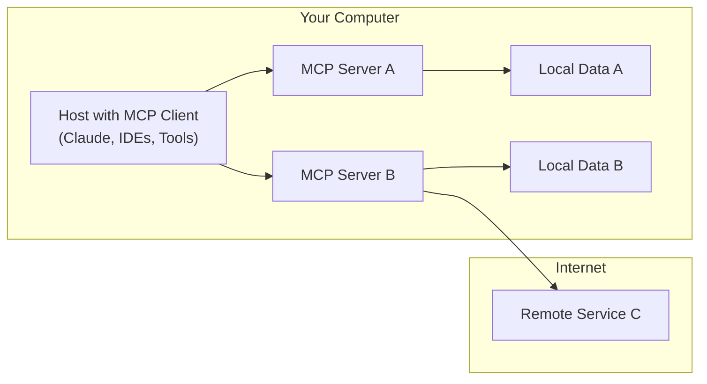

# Model Context Protocol (MCP) Developer Notebook

This developer reference notebook provides key information about the Model Context Protocol (MCP) for building AI integrations.

## What is MCP?

MCP is an open protocol that standardizes how applications provide context to Large Language Models (LLMs). Think of MCP like a USB-C port for AI applications - it provides a standardized way to connect AI models to different data sources and tools.

## Benefits of MCP

* Access to a growing list of pre-built integrations that your LLM can directly use
* Flexibility to switch between LLM providers and vendors
* Best practices for securing your data within your infrastructure

## Architecture Overview

## Key Components

* **MCP Hosts**: Programs like Claude Desktop, IDEs, or AI tools that want to access data through MCP
* **MCP Clients**: Protocol clients that maintain 1:1 connections with servers
* **MCP Servers**: Lightweight programs that each expose specific capabilities through the standardized Model Context Protocol
* **Local Data Sources**: Your computer's files, databases, and services that MCP servers can securely access
* **Remote Services**: External systems available over the internet (e.g., through APIs) that MCP servers can connect to

## Core Concepts

<h3><a href="https://modelcontextprotocol.io/docs/concepts/resources">Resources</a></h3>
Resources expose data and content from your servers to LLMs. They allow you to make different types of data sources available to LLMs in a structured way.

<h3><a href="https://modelcontextprotocol.io/docs/concepts/prompts">Prompts</a></h3>
Create reusable prompt templates and workflows for consistent AI interactions across your applications.

<h3><a href="https://modelcontextprotocol.io/docs/concepts/tools">Tools</a></h3>
Enable LLMs to perform actions through your server - from executing code to accessing databases to calling APIs.

<h3><a href="https://modelcontextprotocol.io/docs/concepts/sampling">Tools</a></h3>
Let your servers request completions from LLMs, essentially allowing bidirectional communication between your systems and the AI.

<h3><a href="https://modelcontextprotocol.io/docs/concepts/transports">Transports</a></h3>
The underlying communication mechanisms that connect all MCP components together.
